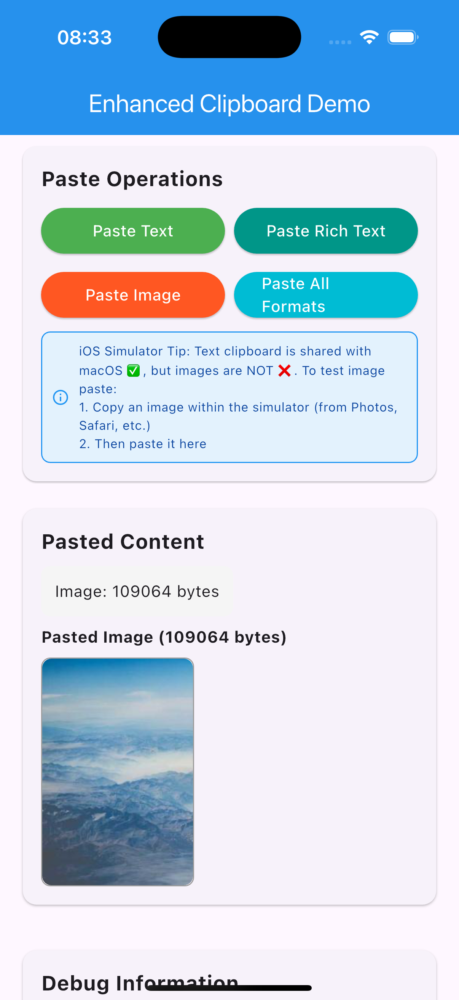
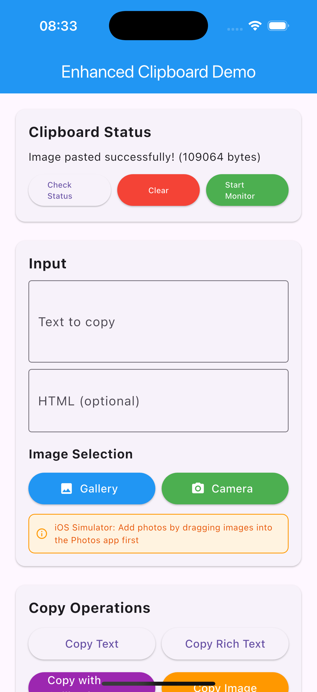
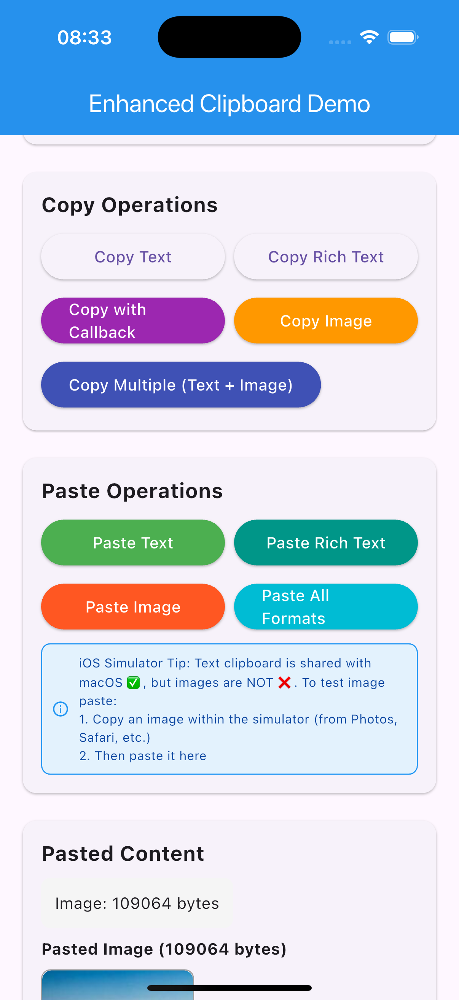
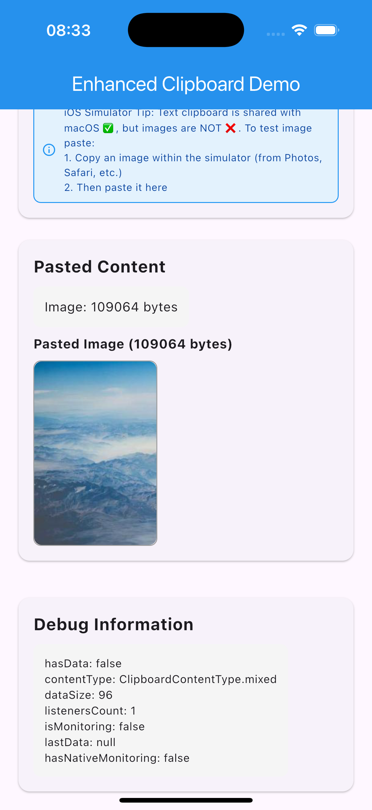

# Enhanced Flutter Clipboard

[](https://github.com/samuelezedi/flutter_clipboard)

A super-power clipboard package for Flutter, with text, Rich text (HTML), and image support.

[GitHub](https://github.com/samuelezedi/flutter_clipboard)

## Screenshots

<div align="center">
  
  
  
  
</div>

## Features

- ✅ **Basic Copy/Paste**: Simple text copying and pasting
- ✅ **True Rich Text Support**: Native HTML clipboard support via platform channels
- ✅ **Image Support**: Copy and paste images to/from clipboard (PNG format)
- ✅ **Multiple Formats**: Copy multiple data formats simultaneously (text, HTML, images)
- ✅ **Native Clipboard Monitoring**: Real-time clipboard change detection using platform APIs
- ✅ **Error Handling**: Comprehensive error handling with custom exceptions and error codes
- ✅ **Utility Methods**: Check clipboard status, size, and content type
- ✅ **Callback Support**: Success and error callbacks for operations
- ✅ **Debug Information**: Get detailed clipboard debugging info
- ✅ **Cross-Platform**: Works on Android, iOS, Web, and Windows with graceful fallbacks
- ✅ **Null Safety**: Full null safety support
- ✅ **Memory Safe**: Proper listener management with cleanup mechanisms
- ✅ **Production Ready**: Battle-tested with comprehensive error handling

## Installation

Add this to your package's `pubspec.yaml` file:

```yaml
dependencies:
  clipboard: ^3.0.14
```

## Platform Setup

### Android
The package uses platform channels for enhanced features. No additional setup required - the package automatically falls back to Flutter's built-in Clipboard API if platform channels are unavailable.

### iOS
No additional setup required. The package automatically handles platform channel registration.

### Web
Fully supported with automatic fallback to browser Clipboard API.

### Windows
No additional setup required. The package uses native Windows API with GDI+ for image support. Platform channels are automatically registered.

## Basic Usage

```dart
import 'package:clipboard/clipboard.dart';
```

### Copy to clipboard

```dart
// Basic copy
await FlutterClipboard.copy('Hello Flutter friends');

// Copy with error handling
try {
  await FlutterClipboard.copy('Hello World');
  print('Text copied successfully!');
} on ClipboardException catch (e) {
  print('Copy failed: ${e.message}');
}
```

### Paste from clipboard

```dart
// Basic paste
String text = await FlutterClipboard.paste();

// Paste with error handling
try {
  String text = await FlutterClipboard.paste();
  setState(() {
    myTextField.text = text;
  });
} on ClipboardException catch (e) {
  print('Paste failed: ${e.message}');
}
```

## Advanced Features

### Rich Text Support

```dart
// Copy rich text with HTML
await FlutterClipboard.copyRichText(
  text: 'Hello World',
  html: '<b>Hello</b> <i>World</i>',
);

// Paste rich text
EnhancedClipboardData data = await FlutterClipboard.pasteRichText();
print('Text: ${data.text}');
print('HTML: ${data.html}');
```

### Multiple Format Copy

```dart
// Copy multiple formats simultaneously
await FlutterClipboard.copyMultiple({
  'text/plain': 'Hello World',
  'text/html': '<b>Hello World</b>',
  'image/png': imageBytes, // Uint8List of PNG image
  'custom/format': 'Custom data',
});
```

### Image Copy/Paste

```dart
import 'dart:typed_data';
import 'package:flutter/services.dart';

// Copy image to clipboard
final ByteData imageData = await rootBundle.load('assets/image.png');
final Uint8List imageBytes = imageData.buffer.asUint8List();
await FlutterClipboard.copyImage(imageBytes);

// Paste image from clipboard
final Uint8List? pastedImage = await FlutterClipboard.pasteImage();
if (pastedImage != null) {
  // Use the image bytes (e.g., display in Image.memory)
  Image.memory(pastedImage);
}

// Images are also included in pasteRichText()
final data = await FlutterClipboard.pasteRichText();
if (data.hasImage) {
  print('Clipboard contains image: ${data.imageBytes?.length} bytes');
}
```

### Callback Support

```dart
// Copy with success/error callbacks
await FlutterClipboard.copyWithCallback(
  text: 'Hello World',
  onSuccess: () {
    print('Copy successful!');
    showSnackBar('Text copied to clipboard');
  },
  onError: (error) {
    print('Copy failed: $error');
    showSnackBar('Copy failed: $error');
  },
);
```

### Clipboard Monitoring

```dart
// Add clipboard change listener (returns cleanup function)
void onClipboardChanged(EnhancedClipboardData data) {
  print('Clipboard changed: ${data.text}');
}

// Add listener and get cleanup function
final removeListener = FlutterClipboard.addListener(onClipboardChanged);

// Start native monitoring (uses platform APIs when available)
await FlutterClipboard.startMonitoring(interval: Duration(milliseconds: 500));

// Stop monitoring
await FlutterClipboard.stopMonitoring();

// Remove listener (or use the returned cleanup function)
FlutterClipboard.removeListener(onClipboardChanged);
// Or: removeListener();

// Remove all listeners at once
FlutterClipboard.removeAllListeners();
```

### Utility Methods

```dart
// Check if clipboard has content
bool hasData = await FlutterClipboard.hasData();

// Check if clipboard is empty
bool isEmpty = await FlutterClipboard.isEmpty();

// Get clipboard content type
ClipboardContentType type = await FlutterClipboard.getContentType();

// Get clipboard data size
int size = await FlutterClipboard.getDataSize();

// Validate input before copying
bool isValid = FlutterClipboard.isValidInput('Hello World');

// Clear clipboard
await FlutterClipboard.clear();
```

### Debug Information

```dart
// Get comprehensive debug information
Map<String, dynamic> debugInfo = await FlutterClipboard.getDebugInfo();
print(debugInfo);
// Output: {
//   'hasData': true,
//   'contentType': 'ClipboardContentType.text',
//   'dataSize': 11,
//   'listenersCount': 2,
//   'isMonitoring': true,
//   'lastData': 'Hello World'
// }
```

## EnhancedClipboardData Class

The `EnhancedClipboardData` class provides rich information about clipboard content:

```dart
EnhancedClipboardData data = await FlutterClipboard.pasteRichText();

// Check content types
if (data.hasText) print('Has text: ${data.text}');
if (data.hasHtml) print('Has HTML: ${data.html}');
if (data.hasImage) print('Has image: ${data.imageBytes?.length} bytes');
if (data.hasFiles) print('Has file paths: ${data.filePaths}');

// Check if completely empty
if (data.isEmpty) print('Clipboard is empty');

// Get timestamp
print('Copied at: ${data.timestamp}');
```

## Error Handling

The package provides custom exceptions for better error handling:

```dart
try {
  await FlutterClipboard.copy('');
} on ClipboardException catch (e) {
  print('Error: ${e.message}');
  print('Error code: ${e.code}');
}
```

Common error codes:
- `EMPTY_TEXT`: Attempted to copy empty text
- `COPY_ERROR`: General copy operation failed
- `PASTE_ERROR`: General paste operation failed
- `EMPTY_CONTENT`: No content provided for rich text copy
- `EMPTY_FORMATS`: No formats provided for multiple format copy

## Content Types

The `ClipboardContentType` enum provides information about clipboard content:

```dart
ClipboardContentType type = await FlutterClipboard.getContentType();

switch (type) {
  case ClipboardContentType.text:
    print('Plain text content');
    break;
  case ClipboardContentType.html:
    print('HTML content');
    break;
  case ClipboardContentType.mixed:
    print('Mixed content (text + HTML)');
    break;
  case ClipboardContentType.empty:
    print('Empty clipboard');
    break;
  case ClipboardContentType.unknown:
    print('Unknown content type');
    break;
}
```

## Legacy Methods

For backward compatibility, the original methods are still available:

```dart
// Legacy methods (still supported)
bool success = await FlutterClipboard.controlC('Hello World');
dynamic data = await FlutterClipboard.controlV();
```

## Testing

The package includes comprehensive testing utilities:

```dart
// Set mock data for testing
await FlutterClipboard.setMockData('Test data');

// Get debug information for testing
Map<String, dynamic> info = await FlutterClipboard.getDebugInfo();
```

## Why This Enhanced Package?

I originally built this package 4 years ago for basic clipboard functionality. Over time, I realized developers needed more advanced features:

- **True Rich Text Support**: Native HTML clipboard support via platform channels (not just in-memory storage)
- **Native Monitoring**: Real-time clipboard change detection using platform APIs (Android clipboard listeners, iOS notifications)
- **Better Error Handling**: Proper exceptions with error codes for better debugging
- **Utility Methods**: Check clipboard status, content type, and data size
- **Debug Support**: Comprehensive debugging information
- **Memory Safe**: Proper listener management prevents memory leaks
- **Production Ready**: Graceful fallbacks ensure reliability across all platforms
- **Modern API**: Updated to latest Dart/Flutter standards with platform channel support

This enhanced version maintains backward compatibility while adding powerful new features that modern Flutter apps need. The package now uses platform channels for true multi-format support and native clipboard monitoring, with automatic fallbacks to Flutter's built-in Clipboard API when needed.

## Contributing

Contributions are welcome! Please feel free to submit a Pull Request.

## License

This project is licensed under the MIT License - see the [LICENSE](LICENSE) file for details.

## Follow Me

- [GitHub](https://github.com/samuelezedi)
- [Medium](https://medium.com/@samuelezedi)
- [Instagram](https://instagram.com/_zedempire)